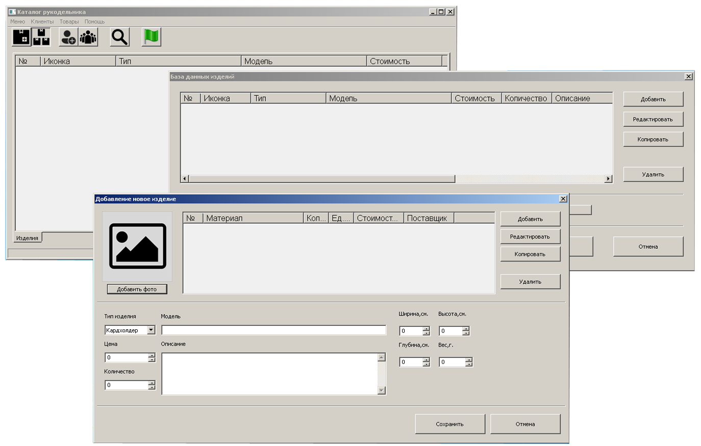
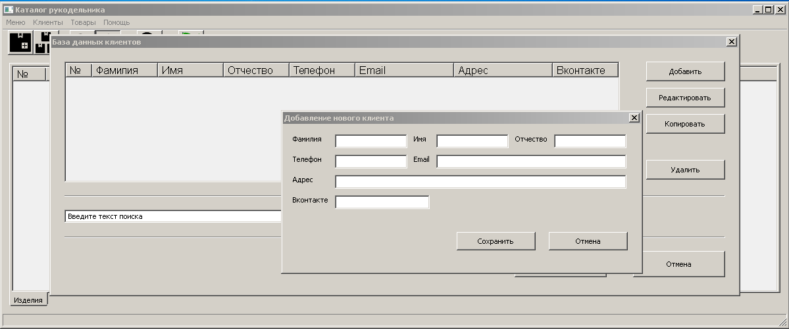

# Catalog_HM

Python 3.7.5, WxPython 4.1.1, Sqlite3

## Приложение для людей занимающихся «хэндмейдом».
Позволяет хранить основные данные (характеристики, фотографию) созданного изделия, а так же список компонентов из которых оно состоит. Хранит данные покупателей (заказчиков).
В полной версии (Оформлять покупки, заказы с последующей обработкой и выводом статистики)

### Установка
Для работы необходимо установить:
- Язык программирования - Python 3.7.5
- Фреймворк - WxPython 4.1.1

Перед запуском приложения необходимо сформировать базу данных запустив **creator_database.py** в корне каталога:

`python creator_database.py`

Для запуска приложения достаточно просто скопировать репозиторий и запустить **catalog_hm.py**.

`python catalog_hm.py`

### Описание
Фреймворком WxPython создается дружелюбный интерфейс для пользователя. Все данные сохраняются в БД sqlite3. Почти все запросы обрабатываются в самом БД, фреймворк получает результаты и выводит их пользователю.

